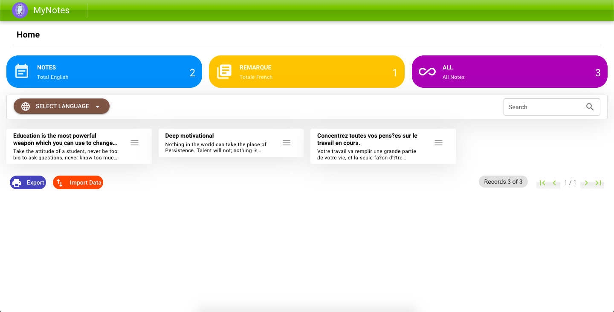
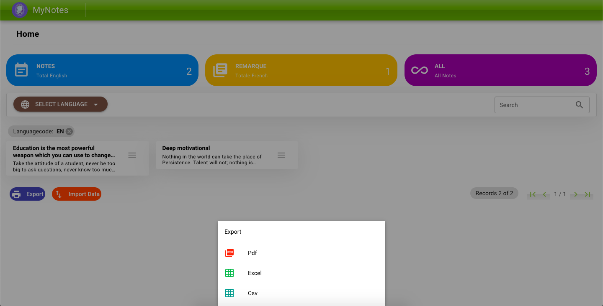
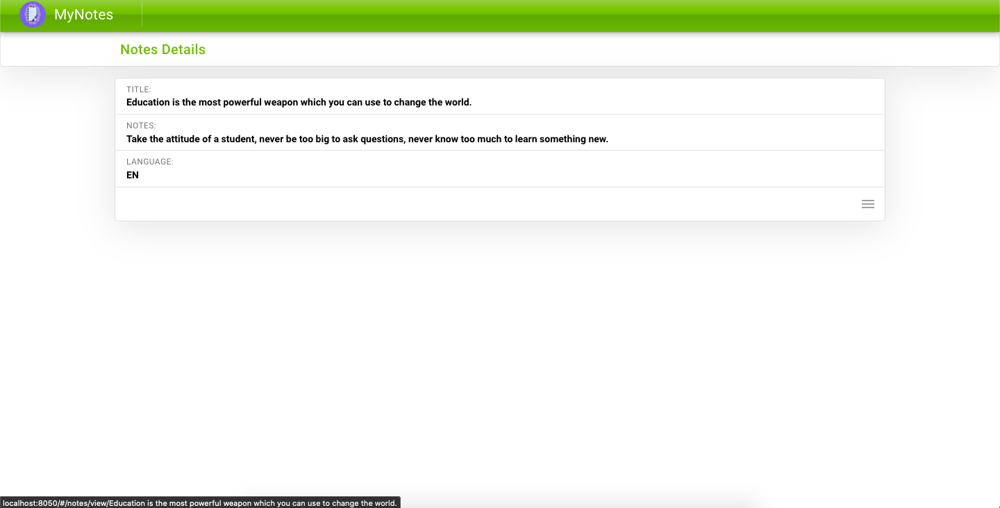

# MY NOTES v1.0.0
A simple Web Application for a client to view the 
```stored content``` in their preferred language.
The display is data stored in a database in multiple languages ```(English and French)```
This project comes in Two-part namely the Frontend Part and the Backend Part.

The Backend was built using ```ASP.Net Core``` with ```SQL server``` and the Frontend was built using ```Quasar VueJS``` which gives us a lot of opportunities to deploy on multi-platforms.

Built this project currently for the Web using ```Single Page Application (SPA)```.
This project doesn’t need to reload the page during its use and works within a browser.

For this project to run perfectly, Both the Backend part (.NET Core) and Frontend Part(Quasar) should be running smoothly.

Backend runs on ```port 8086``` whilst the Frontend on ```port 8085``` when running it locally.


## ***PREVIEW***

| HOME PAGE | EXPORT |DETAILS PAGE|
|     ------------- | ------------- | ------------- |
| | ||


# FRONTEND PART
For the frontend to work perfectly, the following should be followed. Navigate to the ```frontend folder```
 first


## Install the dependencies
```bash
npm install
```


>Make sure  Quasar CLI is installed before running quasar

```
npm install -g @quasar/cli 
```


### Start the app in development mode (hot-code reloading, error reporting, etc.)
```bash
quasar dev
```


### Build the app for production
```bash
quasar build
```

### Frontend Local URL
```bash
http://localhost:8050
```


### Customize the configuration
See [Configuring quasar.conf.js](https://quasar.dev/quasar-cli/quasar-conf-js).


# BACKEND PART

For the backend to work perfectly, the following should be followed. Make sure ```ASP.Net Core SDK``` is downloaded on your system.

### Test the version of ASP.DOTNET CORE
```bash
dotnet --version
```

### Run the Backend locally using the below command
```bash
dotnet run
```


### Backend Local API
```bash
http://localhost:8050
```


# TOOLS USED
- Docker
- GIT and GITHUB
- VS CODE
- POSTMAN
- MS SQL SERVER MANAGEMENT STUDIO
- Azure Data Studio (Mac User)


# TODO

- [x] Containerize Backend

- [ ] Launch the project on a live server.

- [-] Custom domain and ssl.


